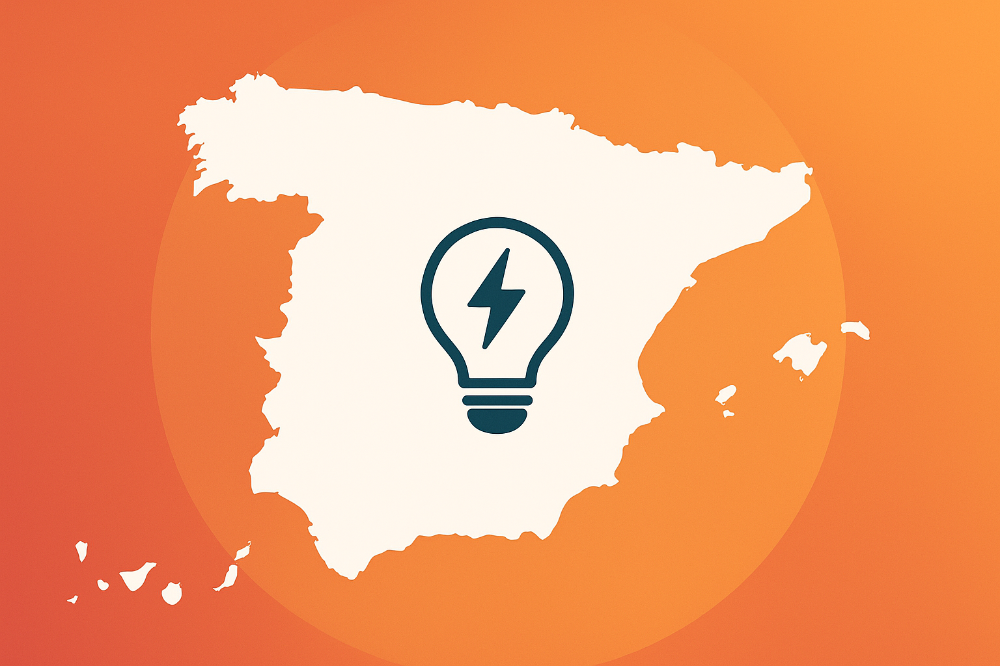

# Accueil

Bienvenue dans la documentation du projet **Prévision de la Demande Énergétique en Espagne**.  
Ce projet a pour objectif de :

1. **Collecter** et préparer les données (API REE, PVPC, météo).  
2. **Nettoyer** et **enrichir** les séries temporelles (features calendaires, lag, etc.).  
3. **Entraîner** et comparer des modèles classiques (ElasticNet, RandomForest, ARIMA…) et Deep Learning (LSTM, GRU, CNN-LSTM).  
4. **Évaluer** la performance avec la métrique **RMSE** et sélectionner les meilleurs.  
5. Déployer un **dashboard** Streamlit pour visualiser les prévisions.

---

Pour commencer, accédez à la section **Introduction**.
