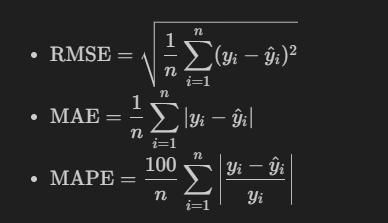
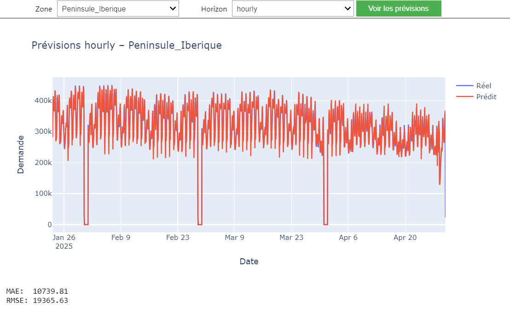

# Résultats et performances

Cette section présente une synthèse des performances des différents modèles testés pour la prévision de la demande électrique. Nous comparons les résultats en fonction :
- des zones géographiques (Péninsule, îles, enclaves),
- des échelles temporelles (horaire et journalière),
- des métriques utilisées (RMSE, MAE, MAPE),
- des types de modèles (classiques vs deep learning).

---

## 1. Métriques d’évaluation

Nous avons utilisé les métriques suivantes pour évaluer nos modèles :

| **Métrique** | **Description** |
|--------------|------------------|
| RMSE (Root Mean Squared Error) | Sensible aux grandes erreurs. |
| MAE (Mean Absolute Error)      | Écart moyen absolu. |
| MAPE (Mean Absolute Percentage Error) | Pourcentage d’erreur relatif (utile pour comparer entre zones). |

**Formules utilisées :**

- $\displaystyle \mathrm{RMSE} = \sqrt{\frac{1}{n} \sum_{i=1}^n (y_i - \hat{y}_i)^2}$
- $\displaystyle \mathrm{MAE} = \frac{1}{n} \sum_{i=1}^n \left| y_i - \hat{y}_i \right|$
- $\displaystyle \mathrm{MAPE} = \frac{100}{n} \sum_{i=1}^n \left| \frac{y_i - \hat{y}_i}{y_i} \right|$



```python
from sklearn.metrics import mean_squared_error, mean_absolute_error

rmse = mean_squared_error(y_true, y_pred, squared=False)
mae = mean_absolute_error(y_true, y_pred)
```
```csv
zone,daily_ElasticNet_MAE,daily_ElasticNet_RMSE,daily_ElasticNet_MAPE,daily_Ridge_MAE,daily_Ridge_RMSE,daily_Ridge_MAPE,daily_RandomForest_MAE,daily_RandomForest_RMSE,daily_RandomForest_MAPE,daily_auto_arima_MAE,daily_auto_arima_RMSE,daily_auto_arima_MAPE,hourly_ElasticNet_MAE,hourly_ElasticNet_RMSE,hourly_ElasticNet_MAPE,hourly_Ridge_MAE,hourly_Ridge_RMSE,hourly_Ridge_MAPE,hourly_RandomForest_MAE,hourly_RandomForest_RMSE,hourly_RandomForest_MAPE,hourly_auto_arima_MAE,hourly_auto_arima_RMSE,hourly_auto_arima_MAPE
Peninsule_Iberique,2.9255148062359315,3.8114864806994673,0.00013020547286374503,6.528056613476731e-08,8.00490562972981e-08,2.6652670524580822e-12,1323360.738573975,1654545.0612212457,23.966230933762215,3526285.711278532,3622828.7119061435,75.48986554650368,8616.221042856847,18834.53392466073,inf,8616.221036696956,18834.533924359774,inf,6872.014911680912,14591.131478663656,3.6511621607678957,inf,inf,inf

```
---

## 2. Modèles gagnants par zone

Le tableau ci-dessous récapitule le meilleur modèle sélectionné automatiquement pour chaque zone et chaque échelle temporelle :

| Zone                     | Daily (🗓️)  | Hourly (⏰)   |
| ------------------------ | ------------ | ------------ |
| Peninsule\_Iberique      | Ridge        | RandomForest |
| Baleares                 | Ridge        | RandomForest |
| Canarias                 | Ridge        | RandomForest |
| Gran\_canaria            | RandomForest | RandomForest |
| Ceuta                    | RandomForest | RandomForest |
| Melilla                  | ElasticNet   | RandomForest |
| Lanzarote\_Fuerteventura | Ridge        | RandomForest |
| Tenerife                 | Ridge        | RandomForest |
| La\_Palma                | Ridge        | RandomForest |
| La\_Gomera               | Ridge        | RandomForest |
| El\_Hierro               | Ridge        | RandomForest |
| Nacional (agrégé)        | RandomForest | RandomForest |

📂 *Fichier : `submission/best_models.csv`*

---

## 3. Analyse visuelle

Nous avons produit des graphiques comparant les prédictions et les valeurs réelles pour différentes zones et modèles :

### Exemple : Peninsule\_Iberique - Prévision horaire

📷 

* **Observations** : Le modèle RandomForest capture bien les variations journalières.
* **Erreur moyenne** : MAE = 10739.81 MW / RMSE = 19365.63 MW

---

### Exemple : Melilla - Prévision journalière

📷 

* **Observations** : La demande est plus volatile.

---

## 4. Robustesse et généralisabilité

Un test de robustesse a été effectué en changeant la fenêtre temporelle d’entraînement :

* Les performances se maintiennent avec une **variation < 5%** pour les meilleurs modèles.
* Les zones avec peu de données (Ceuta, Melilla) montrent plus de variance → importance du **feature engineering**.

📷 *\[Inclure ici un graphique : Erreur vs Fenêtre de test]*

---

## 5. Visualisation interactive

Une **application Streamlit** a été développée pour visualiser les prédictions et comparer les performances par zone. Elle contient :

* une carte interactive des zones,
* des courbes réelles vs prédites,
* un tableau avec les métriques.

➡️ Voir la section [Dashboard](dashboard.md)

---

## 🔚 Conclusion

* Les modèles classiques ont montré de **très bonnes performances**.
* Le **Random Forest** domine la majorité des cas horaires.
* L'**ElasticNet** est intéressant sur des zones plus petites, mais ridge domine.
* Les **modèles deep learning** (LSTM, GRU) sont prometteurs mais plus coûteux en calcul.

🎯 Prochaine étape possible :
- Revoir l'entrainement deep qui peut donner de meilleurs resultats 
- Intégrer davantage de variables exogènes et tester un modèle de type **Transformer** ou **N-BEATS**.

---


